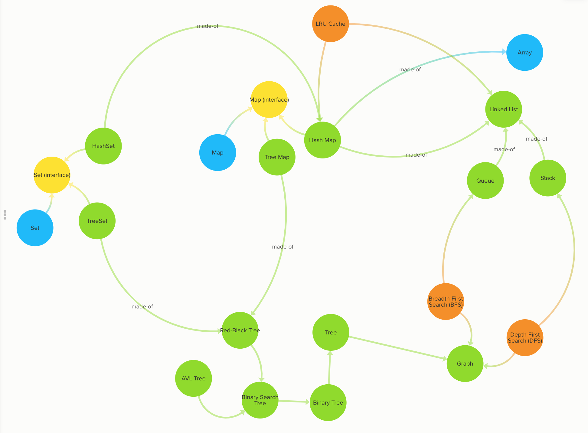

# 450 Data Structures and Algorithms

450 DSA Cracker helps you build your confidence in solving any coding
related question and helps you prepare for your placements 👨🏻‍🎓

[DSA Cracker Sheet](https://drive.google.com/file/d/1FMdN_OCfOI0iAeDlqswCiC2DZzD4nPsb/view) by [Love Babbar](https://www.linkedin.com/in/love-babbar-38ab2887/) 🙏🏻 ❤️

  

 

## ❤️ Project Admin

<table>
	<tr>
		<td align="center">
			<a href="https://github.com/shubhigupta991">
				
				  <b>Shubhangi Gupta</b>
			</a>
			  <a href="https://github.com/shubhigupta991">
		👑 Admin
	    </a>
		</td>
	</tr>
</table>

## Maintainers 😇

<table>
	<tr>
    <td align="center">
      <a href="https://github.com/aryasoni98">
        
          <b>Arya Soni</b>
      </a>
    </td>
		<td align="center">
			<a href="https://github.com/vanshita2123">
				
				  <b>Vanshita Gupta</b>
			</a>
		</td>
    <td align="center">
			<a href="https://github.com/twadhwa">
				
				  <b>Tushar Wadhwa</b>
			</a>
		</td>
	</tr>
</table>

## Discord

## License

This project follows the [MIT License](https://github.com/CodeTrophs/450DSA/blob/main/LICENSE).

